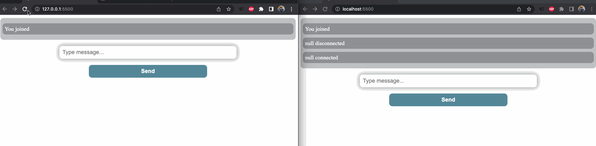

# Objective

**This project was designed to simulate a real-time chat app such as Facebook messenger or iMessage. It showcases how communication works between a server and one or more web browsers.**

# Technologies Used

**JavaScript, HTML, CSS, Socket.IO, NodeJS, npm**

# Challenges Faced

**This project required some debugging when attempting to connect to the server from my HTML file. I learned that CORS, a HTTP-header based mechanism that allows a server to indicate origins from which a browser should load resources, restricts external ports from communicating unless explicitly allowed. Thankfully, I was able to come up wth a solution swiftly which allowed my webpage to communicate with my server.**

# Lessons Learned

**I learned how servers communicate with each other, and how to utilize that communication, through my experience with this project. I also gained some valuable experience with NodeJS and npm, as well as got my hands dirty with creating web sockets using Socket.io. Lastly, I implemented some simple CSS knowledge to make the webpage look a bit prettier.**

# Example

